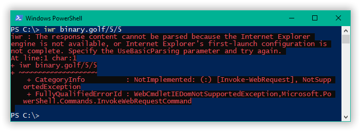
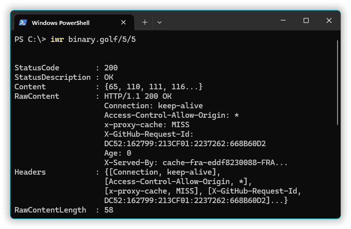
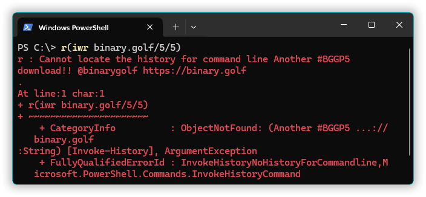
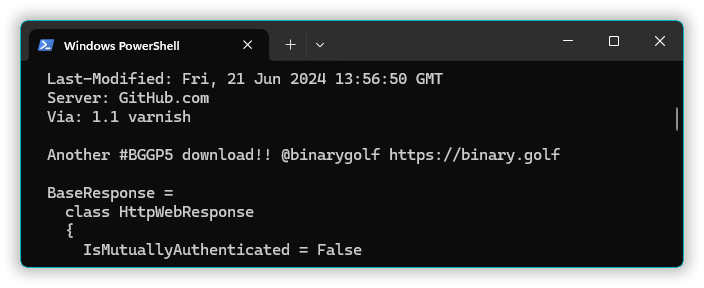
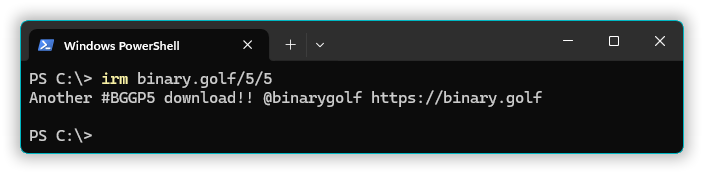
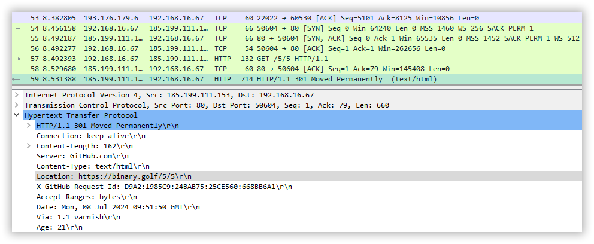
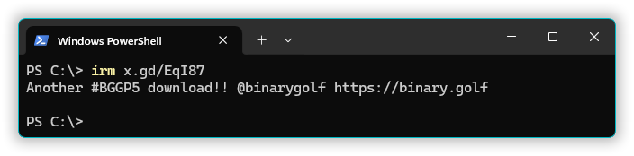

= BGGP5: 14-byte powershell
:Revision: 2024-07-07
:hardbreaks:
:toc: center
:toclevels: 3
:max-width: 94%

== Binary Golf Grand Prix 5
Binary Golf Grand Prix is an annual small file competition.

//include::../README.adoc[tag=bggp5] // wtf, github doesn't support includes; copypasta then:
The theme for BGGP5, held in 2024, is link:https://binary.golf/5/[Download].
The task is to create the smallest possible script or binary in a specific file type category. The created app should download the text file link:https://binary.golf/5/5[] and display its contents in some way.

== What?
Hey, what? Just the string `binary.golf/5/5` is 15 bytes. How can an entire script be just 14 bytes?
Well, it's quite easy, actually. In fact, you can go as low as 6 or 5 bytes, but that requires some uncanny tweaks or hacks.

== TLDR
See <
>.

=== Restraints
For this entry, I've decided to self-impose certain restraints:

* No extra command-line args.
  Aside from the path to the script, obviously.

* No environment or environment variables changes.
  Except possibly changing ExecutionPolicy to allow the script to run in the first place.

* No filepath or filename stuffing.
  I've already employed filename stuffing in link:batch3.adoc[batch3] (entry link:https://github.com/binarygolf/BGGP/issues/102[#102]), so there's no point repeating the same trick twice.

Also, it appears the rules don't actually require saving the content to a file on disk; they just require displaying it in some way. Let's abuse that!

=== Powershell versions
I'm targeting the PowerShell bundled with modern Windows OS (Windows 10 and Windows 11) at the time of writing (2024-07), not other versions available for separate download and installation. That is, `$PSVersionTable.PSVersion` should be `5.1.xxx`, not 6-something or 7-something. After all, it's BGGP5, not BGGP7.

=== Pre-setup
To execute Powershell script, save it in a file with a .ps1 extension and adjust the execution policy to allow unsigned scripts to run. That's a step you gotta take at least once to exec any unsigned PowerShell scripts.
Execution policy adjustment example: `Set-ExecutionPolicy -Scope CurrentUser -ExecutionPolicy RemoteSigned`.

== Analysis
Powershell has notoriously long cmdlet names, so if we really want to minimize size, we may have to use standard aliases.

.PS> Get-Alias
[%collapsible]
====
----
CommandType     Name                                               Version    Source
-----------     ----                                               -------    ------
Alias           % -> ForEach-Object
Alias           ? -> Where-Object
Alias           ac -> Add-Content
Alias           asnp -> Add-PSSnapin
Alias           cat -> Get-Content
Alias           cd -> Set-Location
Alias           CFS -> ConvertFrom-String                          3.1.0.0    Microsoft.PowerShell.Utility
Alias           chdir -> Set-Location
Alias           clc -> Clear-Content
Alias           clear -> Clear-Host
Alias           clhy -> Clear-History
Alias           cli -> Clear-Item
Alias           clp -> Clear-ItemProperty
Alias           cls -> Clear-Host
Alias           clv -> Clear-Variable
Alias           cnsn -> Connect-PSSession
Alias           compare -> Compare-Object
Alias           copy -> Copy-Item
Alias           cp -> Copy-Item
Alias           cpi -> Copy-Item
Alias           cpp -> Copy-ItemProperty
Alias           curl -> Invoke-WebRequest
Alias           cvpa -> Convert-Path
Alias           dbp -> Disable-PSBreakpoint
Alias           del -> Remove-Item
Alias           diff -> Compare-Object
Alias           dir -> Get-ChildItem
Alias           dnsn -> Disconnect-PSSession
Alias           ebp -> Enable-PSBreakpoint
Alias           echo -> Write-Output
Alias           epal -> Export-Alias
Alias           epcsv -> Export-Csv
Alias           epsn -> Export-PSSession
Alias           erase -> Remove-Item
Alias           etsn -> Enter-PSSession
Alias           exsn -> Exit-PSSession
Alias           fc -> Format-Custom
Alias           fhx -> Format-Hex                                  3.1.0.0    Microsoft.PowerShell.Utility
Alias           fl -> Format-List
Alias           foreach -> ForEach-Object
Alias           ft -> Format-Table
Alias           fw -> Format-Wide
Alias           gal -> Get-Alias
Alias           gbp -> Get-PSBreakpoint
Alias           gc -> Get-Content
Alias           gcb -> Get-Clipboard                               3.1.0.0    Microsoft.PowerShell.Management
Alias           gci -> Get-ChildItem
Alias           gcm -> Get-Command
Alias           gcs -> Get-PSCallStack
Alias           gdr -> Get-PSDrive
Alias           ghy -> Get-History
Alias           gi -> Get-Item
Alias           gin -> Get-ComputerInfo                            3.1.0.0    Microsoft.PowerShell.Management
Alias           gjb -> Get-Job
Alias           gl -> Get-Location
Alias           gm -> Get-Member
Alias           gmo -> Get-Module
Alias           gp -> Get-ItemProperty
Alias           gps -> Get-Process
Alias           gpv -> Get-ItemPropertyValue
Alias           group -> Group-Object
Alias           gsn -> Get-PSSession
Alias           gsnp -> Get-PSSnapin
Alias           gsv -> Get-Service
Alias           gtz -> Get-TimeZone                                3.1.0.0    Microsoft.PowerShell.Management
Alias           gu -> Get-Unique
Alias           gv -> Get-Variable
Alias           gwmi -> Get-WmiObject
Alias           h -> Get-History
Alias           history -> Get-History
Alias           icm -> Invoke-Command
Alias           iex -> Invoke-Expression
Alias           ihy -> Invoke-History
Alias           ii -> Invoke-Item
Alias           ipal -> Import-Alias
Alias           ipcsv -> Import-Csv
Alias           ipmo -> Import-Module
Alias           ipsn -> Import-PSSession
Alias           irm -> Invoke-RestMethod
Alias           ise -> powershell_ise.exe
Alias           iwmi -> Invoke-WmiMethod
Alias           iwr -> Invoke-WebRequest
Alias           kill -> Stop-Process
Alias           lp -> Out-Printer
Alias           ls -> Get-ChildItem
Alias           man -> help
Alias           md -> mkdir
Alias           measure -> Measure-Object
Alias           mi -> Move-Item
Alias           mount -> New-PSDrive
Alias           move -> Move-Item
Alias           mp -> Move-ItemProperty
Alias           mv -> Move-Item
Alias           nal -> New-Alias
Alias           ndr -> New-PSDrive
Alias           ni -> New-Item
Alias           nmo -> New-Module
Alias           npssc -> New-PSSessionConfigurationFile
Alias           nsn -> New-PSSession
Alias           nv -> New-Variable
Alias           ogv -> Out-GridView
Alias           oh -> Out-Host
Alias           popd -> Pop-Location
Alias           ps -> Get-Process
Alias           pushd -> Push-Location
Alias           pwd -> Get-Location
Alias           r -> Invoke-History
Alias           rbp -> Remove-PSBreakpoint
Alias           rcjb -> Receive-Job
Alias           rcsn -> Receive-PSSession
Alias           rd -> Remove-Item
Alias           rdr -> Remove-PSDrive
Alias           ren -> Rename-Item
Alias           ri -> Remove-Item
Alias           rjb -> Remove-Job
Alias           rm -> Remove-Item
Alias           rmdir -> Remove-Item
Alias           rmo -> Remove-Module
Alias           rni -> Rename-Item
Alias           rnp -> Rename-ItemProperty
Alias           rp -> Remove-ItemProperty
Alias           rsn -> Remove-PSSession
Alias           rsnp -> Remove-PSSnapin
Alias           rujb -> Resume-Job
Alias           rv -> Remove-Variable
Alias           rvpa -> Resolve-Path
Alias           rwmi -> Remove-WmiObject
Alias           sajb -> Start-Job
Alias           sal -> Set-Alias
Alias           saps -> Start-Process
Alias           sasv -> Start-Service
Alias           sbp -> Set-PSBreakpoint
Alias           sc -> Set-Content
Alias           scb -> Set-Clipboard                               3.1.0.0    Microsoft.PowerShell.Management
Alias           select -> Select-Object
Alias           set -> Set-Variable
Alias           shcm -> Show-Command
Alias           si -> Set-Item
Alias           sl -> Set-Location
Alias           sleep -> Start-Sleep
Alias           sls -> Select-String
Alias           sort -> Sort-Object
Alias           sp -> Set-ItemProperty
Alias           spjb -> Stop-Job
Alias           spps -> Stop-Process
Alias           spsv -> Stop-Service
Alias           start -> Start-Process
Alias           stz -> Set-TimeZone                                3.1.0.0    Microsoft.PowerShell.Management
Alias           sujb -> Suspend-Job
Alias           sv -> Set-Variable
Alias           swmi -> Set-WmiInstance
Alias           tee -> Tee-Object
Alias           trcm -> Trace-Command
Alias           type -> Get-Content
Alias           wget -> Invoke-WebRequest
Alias           where -> Where-Object
Alias           wjb -> Wait-Job
Alias           write -> Write-Output
----
====

Seems like we have some suitable aliases, like `wget` and `iwr`.

=== Using `Invoke-WebRequest` (`iwr`)
One useful cmdlet that can be immediately identified is `Invoke-WebRequest` (it has `wget` and `iwr` aliases).

It seems quite powerful, but it returns a `WebResponseObject`, which should be formatted or otherwise parsed to get a proper representation of the retrieved data.
Additionally, on some Windows 10 systems, the `Invoke-WebRequest` command may spew Internet Explorer browser errors; it's not a major issue, but it'll be nice if we could avoid that.

.PS> iwr binary.golf/5/5
[%collapsible]
====
----
# Error on some systems:

iwr : The response content cannot be parsed because the Internet Explorer engine is not available, or Internet Explorer's first-launch configuration is not complete. Specify the UseBasicParsing parameter and try again.

# Okay on other systems, but need to parse 'Content':

StatusCode        : 200
StatusDescription : OK
Content           : {65, 110, 111, 116...}
RawContent        : HTTP/1.1 200 OK
                    Connection: keep-alive
                    Access-Control-Allow-Origin: *
                    x-proxy-cache: MISS
                    X-GitHub-Request-Id: 2872:0ED2:35AF23D:36C7FB1:668421F7
                    Age: 0
                    X-Served-By: cache-fra-eddf8230091-FRA
                    X...
Headers           : {[Connection, keep-alive], [Access-Control-Allow-Origin, *], [x-proxy-cache, MISS],
                    [X-GitHub-Request-Id, 2872:0ED2:35AF23D:36C7FB1:668421F7]...}
RawContentLength  : 58
----
====

.Invoke-WebRequest on system without Internet Explorer:

.Invoke-WebRequest on regular Windows 11:

==== Parsing Content of WebResponse object
Let's see how we can parse the "Content" field of the WebResponseObject returned by `Invoke-WebRequest`. Maybe that'll allow us to minimize script size?

===== Using "Invoke-History"

.PS> r(iwr binary.golf/5/5)
[%collapsible]
====
----
r : Cannot locate the history for command line Another #BGGP5 download!! @binarygolf https://binary.golf
----
====

Alright, with the hacky use of `r` (alias for `Invoke-History`), we got an error, but we also got content of the remote file displayed. Should be good enough. With this method, we get a 22-byte script.

===== Using `Format-Custom`
One clever variant of formatting "WebResponseObject" is entry link:https://github.com/binarygolf/BGGP/issues/32[#32] - 22-byte powershell script, by link:https://github.com/nephryte[nephryte]. It goes as `iwr binary.golf/5/5|fc` - pipe redirection to `fc` (alias for `Format-Custom`). It gives longass output of about 260 lines, but definitely gets the job done.

.PS> iwr binary.golf/5/5|fc
[%collapsible]
====
----
class WebResponseObject
{
  Content =
    [
      65
      110
      111
      116
      ...
    ]

  StatusCode = 200
  StatusDescription = OK
  RawContentStream =
    class WebResponseContentMemoryStream
    {
      CanRead = True
      CanSeek = True
      CanTimeout = False
      CanWrite = True
      Length = 58
      Capacity = 10000
      Position = 0
      ReadTimeout =
      WriteTimeout =
    }
  RawContentLength = 58
  RawContent = HTTP/1.1 200 OK
  Connection: keep-alive
  Access-Control-Allow-Origin: *
  x-proxy-cache: MISS
  X-GitHub-Request-Id: 6CBE:A8F14:18330DF:18C08A2:668635A0
  Age: 0
  X-Served-By: cache-fra-eddf8230110-FRA
  X-Cache: MISS
  X-Cache-Hits: 0
  X-Timer: S1720071585.737486,VS0,VE110
  Vary: Accept-Encoding
  X-Fastly-Request-ID: 14203171d79bb3c4e7c1d9a341016eadae7b1aa1
  Accept-Ranges: bytes
  Content-Length: 58
  Cache-Control: max-age=600
  Content-Type: application/octet-stream
  Date: Thu, 04 Jul 2024 05:39:44 GMT
  Expires: Thu, 04 Jul 2024 05:49:44 GMT
  ETag: "667586a2-3a"
  Last-Modified: Fri, 21 Jun 2024 13:56:50 GMT
  Server: GitHub.com
  Via: 1.1 varnish

  Another #BGGP5 download!! @binarygolf https://binary.golf

  BaseResponse =
    class HttpWebResponse
    {
      IsMutuallyAuthenticated = False
      Cookies =
        [
        ]

      Headers =
        [
          Connection
          Access-Control-Allow-Origin
          x-proxy-cache
          X-GitHub-Request-Id
          ...
        ]

      SupportsHeaders = True
      ContentLength = 58
      ContentEncoding =
      ContentType = application/octet-stream
      CharacterSet =
      Server = GitHub.com
      LastModified =
        class DateTime
        {
          Date =
            class DateTime
            {
              Date =
                class DateTime
                {
                  Date =
                    class DateTime
                    {
                      Date = 6/21/2024 12:00:00 AM
                      Day = 21
                      DayOfWeek = Friday
                      DayOfYear = 173
                      Hour = 0
                      Kind = Local
                      Millisecond = 0
                      Minute = 0
                      Month = 6
                      Second = 0
                      Ticks = 638545248000000000
                      TimeOfDay = 00:00:00
                      Year = 2024
                      DateTime = Friday, June 21, 2024 12:00:00 AM
                    }
                  Day = 21
                  DayOfWeek = Friday
                  DayOfYear = 173
                  Hour = 0
                  Kind = Local
                  Millisecond = 0
                  Minute = 0
                  Month = 6
                  Second = 0
                  Ticks = 638545248000000000
                  TimeOfDay =
                    class TimeSpan
                    {
                      Ticks = 0
                      Days = 0
                      Hours = 0
                      Milliseconds = 0
                      Minutes = 0
                      Seconds = 0
                      TotalDays = 0
                      TotalHours = 0
                      TotalMilliseconds = 0
                      TotalMinutes = 0
                      TotalSeconds = 0
                    }
                  Year = 2024
                  DateTime = Friday, June 21, 2024 12:00:00 AM
                }
              Day = 21
              DayOfWeek = Friday
              DayOfYear = 173
              Hour = 0
              Kind = Local
              Millisecond = 0
              Minute = 0
              Month = 6
              Second = 0
              Ticks = 638545248000000000
              TimeOfDay =
                class TimeSpan
                {
                  Ticks = 0
                  Days = 0
                  Hours = 0
                  Milliseconds = 0
                  Minutes = 0
                  Seconds = 0
                  TotalDays = 0
                  TotalHours = 0
                  TotalMilliseconds = 0
                  TotalMinutes = 0
                  TotalSeconds = 0
                }
              Year = 2024
              DateTime = Friday, June 21, 2024 12:00:00 AM
            }
          Day = 21
          DayOfWeek = Friday
          DayOfYear = 173
          Hour = 6
          Kind = Local
          Millisecond = 0
          Minute = 56
          Month = 6
          Second = 50
          Ticks = 638545498100000000
          TimeOfDay =
            class TimeSpan
            {
              Ticks = 250100000000
              Days = 0
              Hours = 6
              Milliseconds = 0
              Minutes = 56
              Seconds = 50
              TotalDays = 0.289467592592593
              TotalHours = 6.94722222222222
              TotalMilliseconds = 25010000
              TotalMinutes = 416.833333333333
              TotalSeconds = 25010
            }
          Year = 2024
          DateTime = Friday, June 21, 2024 6:56:50 AM
        }
      StatusCode = OK
      StatusDescription = OK
      ProtocolVersion =
        class Version
        {
          Major = 1
          Minor = 1
          Build = -1
          Revision = -1
          MajorRevision = -1
          MinorRevision = -1
        }
      ResponseUri =
        class Uri
        {
          AbsolutePath = /5/5
          AbsoluteUri = https://binary.golf/5/5
          LocalPath = /5/5
          Authority = binary.golf
          HostNameType = Dns
          IsDefaultPort = True
          IsFile = False
          IsLoopback = False
          PathAndQuery = /5/5
          Segments =
            [
              /
              5/
              5
            ]

          IsUnc = False
          Host = binary.golf
          Port = 443
          Query =
          Fragment =
          Scheme = https
          OriginalString = https://binary.golf/5/5
          DnsSafeHost = binary.golf
          IdnHost = binary.golf
          IsAbsoluteUri = True
          UserEscaped = False
          UserInfo =
        }
      Method = GET
      IsFromCache = False
    }
  Headers =
    [
      class 0, Culture=neutral, PublicKeyToken=b77a5c561934e089]]
      {
        Key = Connection
        Value = keep-alive
      }
      class 0, Culture=neutral, PublicKeyToken=b77a5c561934e089]]
      {
        Key = Access-Control-Allow-Origin
        Value = *
      }
      class 0, Culture=neutral, PublicKeyToken=b77a5c561934e089]]
      {
        Key = x-proxy-cache
        Value = MISS
      }
      class 0, Culture=neutral, PublicKeyToken=b77a5c561934e089]]
      {
        Key = X-GitHub-Request-Id
        Value = 6CBE:A8F14:18330DF:18C08A2:668635A0
      }
      ...
    ]

}
----
====

This again gives us 22 bytes. So it looks like 22 bytes is the minimum for the `iwr` method (with a vanilla URL).

=== Using `Invoke-RestMethod` (`irm`)
Another seemingly suitable cmdlet is `Invoke-RestMethod`, with the short alias `irm`.
It sends an HTTP/HTTPS request to a "RESTful web service" and returns the content as a string object. REST-style requests imply there is no state (each request should contain all necessary information).

.PS> Get-Help 'Invoke-RestMethod'
[%collapsible]
====
----
Get-Help Invoke-RestMethod

NAME
    Invoke-RestMethod

SYNTAX
    Invoke-RestMethod [-Uri] <uri> [-Method {Default | Get | Head | Post | Put | Delete | Trace | Options | Merge | Patch}]
    [-UseBasicParsing] [-WebSession <WebRequestSession>] [-SessionVariable <string>]
    [-Credential <pscredential>] [-UseDefaultCredentials]
    [-CertificateThumbprint <string>] [-Certificate <X509Certificate>]
    [-UserAgent <string>] [-DisableKeepAlive] [-TimeoutSec <int>] [-Headers <IDictionary>] [-MaximumRedirection <int>]
    [-Proxy <uri>] [-ProxyCredential <pscredential>] [-ProxyUseDefaultCredentials]
    [-Body <Object>] [-ContentType <string>]
    [-TransferEncoding {chunked | compress | deflate | gzip | identity}]
    [-InFile <string>] [-OutFile <string>] [-PassThru] [<CommonParameters>]

ALIASES
    irm
----
====

By default, the cmdlet `Invoke-RestMethod` uses the GET method. So yeah, for our purposes here, it's just a regular HTTPS request.
While it's less powerful than `Invoke-WebRequest`, it's exactly what we want: it returns the response body as a string (rather than a WebResponseObject), and it's available even without Internet Explorer.

.PS> irm binary.golf/5/5
[%collapsible]
====
----
Another #BGGP5 download!! @binarygolf https://binary.golf
----
====

This gets us down to a 19-byte script.

=== Making it smaller
Without filepath and filename stuffing tricks, extra command-line args, and environment variables, we're quite limited in what we can do to reduce the size further. I mean, just look at the 19-byte script `irm binary.golf/5/5` - the longest part here is the URL, taking 15 bytes.
So what can we do? Shorten the URL!

We can do that because the `Invoke-RestMethod` cmdlet follows HTTP redirects. When the server returns HTTP code 301 and a new location, the cmdlet will just transparently follow it. The same is true for the `Invoke-WebRequest` cmdlet.
Suitable HTTP codes are 301, 302, and 307. While HTTP 308 - Permanent Redirect - seems suitable too, it is not. The aforementioned cmdlets don't like it and spew errors.

==== Is shortening even legal?
But is it legal to rely on third-party servers or services for the purpose of competition? Well, I'm pretty sure it is, as long as the entry can be independently validated with high enough reliability. Reasons for that:

1. As you're well aware, the Internet is a series of tubes. So even a regular request would already go through multiple third-party tube hubs (run `tracert binary.golf` to see just part of it!). This means adding a few more hops in a higher-level protocol should not matter.

2. There are kinds of entries where HTTP redirects can't be used, or where using them would involve serious size overhead. So if an HTTP redirect can be abused for a particular filetype entry, it should be!

3. This competition has an extremely open nature. So any outlined technique can be immediately reused by other participants. This means it's fair, as there can't be any hidden edge.

4. Finally, some accepted entries already use HTTP redirects. Even a vanilla request like `curl -sL binary.golf/5/5` already does it - it proceeds via unencrypted HTTP first, and only then follows the 301 redirect to the proper HTTPS URL.

.Redirect to HTTPS you get for `curl -sL binary.golf/5/5`:

==== Going with URL shorteners
We can reduce the size from **19** bytes to **14** or less with public URL shortening services.

Requirements for the service:

* Clean HTTP header redirect via codes 301, 302, or 307 (not 308, as Powershell doesn't like it).
  Many services use a landing page with JavaScript or manual confirmation. We can't use these.
* Should support unencrypted HTTP requests (as `irm` uses plain HTTP when the URL is specified without a protocol).
  Some services - such as "s.id" - use code 302 for HTTPS requests, but code 308 when the request comes via plain HTTP.
* Service should allow Powershell useragent.
  Some services - e.g. "e.vg" - ban such user agents.

Without further ado: `irm rb.gy/4jch76`. This 16-byte Powershell script uses the rb.gy free URL shortener service to transparently redirect the request to https://binary.golf/5/5, via an HTTP 301 response. As if clean HTTP header redirection wasn't nice enough, this service also allows checking the number of link clicks: simply append `+` to the link:rb.gy/4jch76+[URL] to check clicks count and other stats.

NOTE: link:https://rb.gy[RB.GY] definitely didn't pay me 0.55555 BTC for this shoutout.

Other services I've checked:
`irm u.to/fpXDIA` - HTTP 302 redirect, 15 bytes.
`irm is.gd/_555_` - HTTP 301 redirect, 15 bytes (allows custom url).
`irm x.gd/EqI87` - HTTP 301 redirect, 14 bytes.

.Going 14 with `irm x.gd/EqI87`:

===== URL shorteners: results
With public shorteners, you can get to **14** bytes right now, or to **10** if you manage to get a very short URL like `x.gd/5`.

==== Registering own domain: 9 bytes
Why depend on a third-party service when we can register our own domain? That way, we won't have to provide an extra URL path.
Well, no reason really. It might be too late to register a 3-letter domain, but a 4-letter domain like link:https://www.youtube.com/watch?v=dQw4w9WgXcQ[nr.pw] will only set us back about $150.

There's also a special trick that can save us some buck. Powershell has a special variable `$?`, which contains either "true" or "false" ("false" if the last operation resulted in an error). When a Powershell script starts, there is no last operation, so the variable contains "true". So we can go for a "true.xx" domain, and use `irm $?.xx` in the script.

`irm nr.pw` - 9 bytes (won't work though, as I have not actually registered this domain).
`irm $?.pw` - 9 bytes, resolves to "true.pw".

===== Own domain name: results
With your own domain name, you can realistically get to a **9**-byte Powershell script. If you somehow get or hack a 3-letter domain like "t.co", you'll get an **8**-byte script.

==== Giving up domain name, using IP: 12 -> 11 -> 7
We don't have to use a domain name for an HTTP request. We can use a plain IP address.

How can we specify an IPv4 address for "Invoke-RestMethod" (or browser):

* Regular IP address, e.g. `irm 1.0.0.1`.
  The minimum filesize for this notation is **11** bytes. We have exactly 9*10*10*10 == 9000 IP addresses suitable for minimum size.

* Plain number IP address, e.g. `irm 16777217`, equivalent to `irm 0x1000001`.
  The left-most digit from dotted notation goes to the most significant byte of the plain number.
  The minimum filesize is **12** bytes (for decimal notation, as hex notation gives 13 bytes).
  Min-size range is [16777216; 99999999], aka [0x01000000; 0x05F5E0FF], aka [1.0.0.0; 5.245.224.255]. That's 83,222,784 IPs.

* Skip-zero IP address, e.g. `irm 1.1`. It's effectively the same as `irm 1.0.0.1`, but shorter.
  A slightly longer variant is `irm 1.1.1`, which is the same as `irm 1.1.0.1`.
  The minimum filesize is **7** bytes, but there are only 9×10 == 90 IP addresses we can hack to install our redirect.
  With 2 zeroes skipped in the middle, we can also go for **8** bytes with `irm 10.1`/`irm 1.10` (90×10+9×90 == 1710 IPs), or for **9** bytes with `irm 100.1`/`irm 1.100` (about 155×10+9×155 == 2945 IPs).
  The longer **9**-byte variant with a single skipped zero allows for 9×9×10 == 810 IP addresses (I'm not counting the 90 IPs which we can represent with 2 dot-separated digits).

===== Using IPs: results
With plain IPv4, you may get as low as **7** bytes, but that's a bit unrealistic. An 8 or 9-byte Powershell script looks more probable, but still, the most likely outcome is **12** bytes.

==== Back to domain name: 7 -> 6
There is a concept of link:https://lab.avl.la/dotless/[dotless domain names]. Basically, it's just top-level domain names.
Currently, not many of them resolve, and there seem to be issues with TLS certs (but the latter doesn't really matter, as we actually do plain HTTP requests).
The minimum TLD length is currently 2 bytes. However, a 1-byte TLD might be introduced in the future, as there don't seem to be any serious technical issues. At least nothing prevents attempts to resolve such domains on my systems.

To use dotless domain names, you have to specify a dot. 😂
Without a trailing dot, Powershell (and most Windows components) would append a connection-specific DNS suffix to the provided name (e.g. `.local`), and the request would not normally go any further than the local DNS server. To check the suffix, use the `Get-DnsClient` cmdlet and examine the "ConnectionSpecificSuffix" column.

Let's check what we can get from the `ai` dotless domain (keep the trailing dot).

.PS> irm ai.
[%collapsible]
====
----
<!DOCTYPE HTML PUBLIC "-//W3C//DTD HTML 4.0 Transitional//EN">
<html>
<head>
</head>
<body>

This is no longer a public website.  If you have come here you are at the wrong place.  You probably want to
go to one of these sites:

<ol>
<li> <a href=http://whois.nic.ai>whois.nic.ai</a>  To do "whois" lookups.
<li> <a href=http://auction.whois.ai>auction.whois.ai</a>  Auction site for expired .ai domains.
<li> <a href=http://whois.ai/faq.html>whois.ai/faq.html</a>  General FAQ for .ai domains.
<li> <a href=http://whois.ai/eppfaq.html>whois.ai/eppfaq.html</a>  FAQ for .ai registrars.
<li> <a href=http://zenaida.cate.ai>zenaida.cate.ai</a> if you used to login here years ago
</ol>

</body>
</html>
----
====

So yeah, that works. If you hack one of the 2-letter TLD domains, you can get a **7**-byte Powershell entry.

But why stop at 2-letter TLD? We can shrink the filesize to **6** bytes if the root DNS servers were to resolve a 1-letter TLD. If you're going to hijack DNS, I recommend hacking the TLD "5". This way, a 6-byte script would be: `irm 5.`

NOTE: Hijacking root DNS servers is left as an exercise for the reader.

===== Domain names take2: results
If you hack one of the dotless 2-letter domains, you can get a **7**-byte script. If you hijack root DNS servers and get yourself a 1-letter domain, you can probably win this with a **6**-byte script.

==== Going 5
It would be nice to have a 5-byte Powershell script for BGGP5. However, currently it doesn't seem to be possible on a global scale (if we stick to the self-imposed <<Restraints>>). That's because one-letter domains without a dot get a connection-specific suffix from the local DNS server, and to my knowledge, these servers won't propagate such requests further.

NOTE: To check the connection-specific DNS suffix, use `Get-DnsClient` cmdlet and examine the "ConnectionSpecificSuffix" column. E.g., if you have "loc" there, then attempting to execute `irm g` will send a DNS request for the `g.loc` domain name.

We can still check out the concept of a 1-letter domain name locally. Just follow these steps:

1. Edit your hosts. E.g. on Windows exec the following from cmd.exe with Administrative privileges:
`(echo.&echo 127.0.0.1 g)>>%windir%\system32\drivers\etc\hosts`

2. Start a Python 3 interpreter and paste the following text into it to start an HTTP redirection server:
+
[source, python]
----
import http.server
http.server.HTTPServer(('', 80), type('', (http.server.BaseHTTPRequestHandler,), {
    'do_GET': lambda self: (
        self.send_response(301),
        self.send_header('Location', 'https://binary.golf/5/5'),
        self.end_headers())
})).serve_forever()
----
+
3. Run Powershell command `irm g`.
That'll connect to localhost and will be _transparently_ redirected to the proper URL, retrieving and displaying downloaded content.

===== Going 5: results
Even though we've shown a **5**-byte Powershell script works, it's not a global solution.

== Summary
Summary for the outlined Powershell methods.

[cols="1,8,28"]
|===
|Script size |Code | Comment

|xref:Using `Invoke-RestMethod` (`irm`)[33]|`Invoke-RestMethod binary.golf/5/5`|Vanilla; transparent HTTP 301 redirect from HTTP to proper HTTPS URL.
|xref:Using `Invoke-RestMethod` (`irm`)[19]|`irm binary.golf/5/5`|Alias `irm` for `Invoke-RestMethod`.
|**xref:Going with URL shorteners[14]**|**`irm x.gd/EqI87`**|URL shortener with HTTP 301 redirect (same number of redirects as above: one).
|xref:Giving up domain name, using IP: 12 -> 11 -> 7[12]|`irm 16777216`|[16777216; 99999999], aka [0x01000000; 0x05F5E0FF], aka [1.0.0.0; 5.245.224.255]; 83,222,784 IPs.
|xref:Giving up domain name, using IP: 12 -> 11 -> 7[11]|`irm 1.0.0.1`|HTTP 301 on server without domain name; 9×10×10×10 == 9000 IP addresses we could use.
|xref:Giving up domain name, using IP: 12 -> 11 -> 7[09]|`irm 100.1`/`irm 1.100`|Two zeroes in the middle ignored (100.1 == 100.0.0.1); about 155×10+9×155 == 2945 IPs.
|xref:Giving up domain name, using IP: 12 -> 11 -> 7[09]|`irm 1.1.1`|Same as 1.1.0.1, zero ignored; 9×9×10 == 810 IP addresses we could use.
|xref:Giving up domain name, using IP: 12 -> 11 -> 7[08]|`irm 10.1`/`irm 1.10`|Two zeroes in the middle ignored; 90×10+9×90 == 1710 IPs.
|xref:Giving up domain name, using IP: 12 -> 11 -> 7[07]|`irm 1.1`|Same as 1.0.0.1, zeroes ignored; 9×10 == 90 IP addresses we could use.
|xref:Back to domain name: 7 -> 6[07]|`irm ai.`|Or other 2-letter domains; gotta hack them first to set up 301 redirect though.
|xref:Back to domain name: 7 -> 6[06]|`irm g.`|Just need to hack root DNS servers for this to work.
|xref:Going 5[05]|`irm g`|Seems to be a local-only solution.
|===

== Links
- Download link:gremlinbeet.powershell14.ps1[powershell14.ps1]
- This entry link:https://github.com/binarygolf/BGGP/issues/109[#109] in BGGP repo
- Interesting entry link:https://github.com/binarygolf/BGGP/issues/32[#32] by link:https://github.com/nephryte[nephryte] - 22-byte Powershell script, via `iwr|fc`
- link:https://lab.avl.la/dotless/[Dotless domains]
- link:https://rb.gy[RB.GY] free URL shortening service
- link:https://x.gd[x.gd] free URL shortening service
